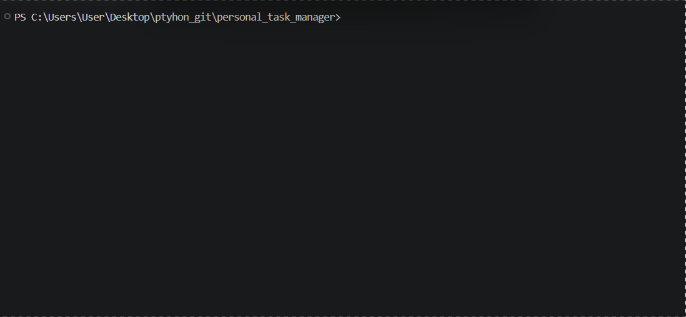

# Personal Task Manager 


A simple personal task manager built with Python

## Table of contents


- [Features](#features)
- [Project Structure](#project-structure)
- [File Description](#file-description)
- [Requirments](#requirments)
- [Installation](#installation)
- [Envoirment Setup](#envoirment-setup)
- [Usage](#usage)
- [Example Output](#example-output)
- [Screenshot](#screenshot)
- [start program](#start-program)
- [add task](#add-task)
- [show tasks](#show-tasks)
- [Demo](#demo)
- [Roadmap](#roadmap)
- [Contributing](#contributing)
- [Licence](#licence)
- [Author](#author)


## Features
- Taks System
  - Asks the player multiple question about their taks.
  - Shows tasks at the end.
- Resulte storage
  - Saves program results in `results.txt`
- Admin Mode
  - asks for the admin password 
  - checks if the password is correct
  - keeps the private information outside the main python file
  - Loads the password from `.env`


## Project Structure

```text
personal_task_manager/
│   .env.example
│   .gitignore
│   main.py
│   tasks.py
│   README.md
│   requirements.txt
│
├───gifs
│       demo.gif
│
├───pictures
│       sc1.png
│       sc2.png
│       sc3.png
└───
```
### File Description
| file | description |
| --- |---|
| `main.py` | main file used to run personal task manager|
| `tasks.py` | a function that shows your tasks|
| `requirements.txt` | lists the python packages needed for the project|
| `.env.example` | shows the envoirment variables needed by the project |
| `.gitignore` | tells git which files and folders shold not be tracked|
|  `README.md` | contains the project documentation|
|  `pictures/` | stores project sreenshots|
|  `pictures/sc1.jpg` | screenshot of the start program|
|  `pictures/sc12.jpg` | screenshot of the task's question|
|  `pictures/sc3.jpg` | screenshot of final result|
|  `gifs/` | stores demo GIF files|
|  `gifs/demo.gif` |shows the project demo|

## Requirments
Before running the project, make sure you have:
- `python 3`
- `python-dotenv`
  
## Installation
1. open a terminal in the project folder.
2. check that python is installed:
```bash
python --version
```
3. install the python packages:
```bash
pip install -r requirements.txt
```  

## Envoirment Setup
1. create a `.env` file from `.env.example`:
```bash
cp .env.example .env
```
2. open the new `.env` file 
3. replace the example value with your own password
```text
TASK_MANAGER_ADMIN_PASSWORD = your_password_here
```
4. save the file.
  
> Do not commit your `.env` file because it may contain private information

## Usage
1. open a terminal in the project folder
2. run the personal task manager
```bash
python main.py
```
3. choose `yes` or `no` for admin mode
4. if you choose `yes`, enter the password from your `.env` file
5. enter your name 
6. answer the questions
7. see your tasks
8. your result is saved in `results.txt`

## Example Output
```text
Do you want to open admin mode? yes/no: no
Please enter your name: alex
welcome alex
Do you want to add a task? (yes/no) yes
Enter your task: homework
Your task has been saved.
Do you want to add a task? (yes/no) no
  
---Tasks---
    Task 1 : homework

```
## Screenshot

### start program


### add task


### show tasks


## Demo 


## Roadmap
- [x] ask question about your task
- [x] add multiple tasks
- [x] save results to a file
- [x] add admin mode
- [ ] add priotority for tasks
- [ ] add a timer
## Contributing

## Licence

## Author
create by [mazda](https://github.com/mazda-farvahari)